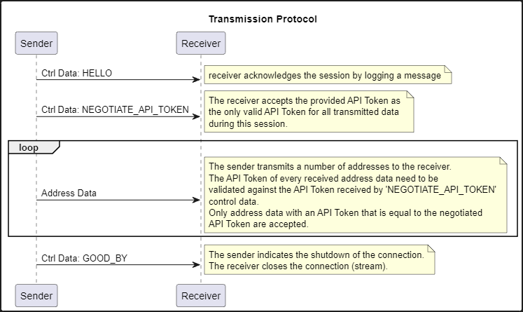

### Assignment: java.io, Serialization, Decorator Pattern, Observer Pattern, RegEx
# Address Shaper

## Objective:
Implementation of an application for receiving 
and processing Java Objects using java.io Streams, Observer Pattern,
Decorator Pattern and Regular Expressions.

## Background Story:
The Corona pandemic required applications for capturing and tracking
various health states of people. Some of those applications where implemented in
a mad rush resulting a mess of address data. Because the data are still valuable,
you are ask to separate the valid from the invalid ones and categorize them.

## Assignment
Given is the application skeleton class 'App' as well as the address source.
The address sends address data and control data as object to the receiver,
over a pipe. This address source is executed in a separate thread in order
to dispatch data concurrently to data reception in the same application process.

### Task 1: Receiver
Implement a receiver of the control and address data running in the 
application main thread (no separate thread is needed for reception).

Sender and Receiver are instantiated within the `App` class. To start data
transmission, the `App` shall invoke the according method of the `Receiver`
instance and pass the instance of the `Sender` to this method.   
The receiver shall open a pipe stream to receive objects from the sender.
The receiver's pipe is connected with the sender via `Sender.registerSink`
method. The sender starts transmission of data immediately after the 
receiver is connected using the method named above.
The `Sender` submits two kind of objects: `CtrlData` and `AddressData`. 
Whereas `AddressData` are used to transmit addresses, `CtrlData` steer the 
communication.
The receiver shall follow the following protocol base on control data:

#### API Token
Be aware that `AddressData` carry an API Token to verify the validity of the 
sending instance. The API Token of the received `AddressData` must be equal to
the API Token that was negotiated. `AddressData` are only received by the receiver
if the API Token is equal to the negotiated one, otherwise an exception shall be thrown.

Implement an exception named `ReceptionException` for this purpose and state the invalid
API Token in the message of a thrown exception.   

The receiving method of the `Receiver` shall accept an `ExceptionHandler` as parameter,
to which any caught exception (esp. `ReceptionException`s) is delegated for handling.

**Important:** An invalid API Token __must not__ abort the complete session (e.g. terminate 
the connection). The receiver shall be able to receive and process further `AddressData`.
Therefore `ReceptionException`s must be caught accordingly and handled.

__Notes:__ 
* Take care about a suitable design of the receiver class, it is probably a good
idea to process received data in dedicated methods.
* The existing class `AddressData` need to be modified to make it transmittable.

### Task 2: Observable Receiver (Observer Pattern)
1. Implement the __'Oberservable'__ part of the __Oberserver Patterm__ within the `Receiver` to
make the reception of addresses observable. 
Only valid (see section 'API Token') addresses shall be notified to registered observers.

1. Implement an interface for __'Observer'__s of addresses in package `at.htlleonding.receiver.listeners`,
you may name it `IAddressListener`. It's only method (e.g. `onAddressReceived`) is invoked upon
reception of valid addresses and takes the address as parameter.

1. Implement a concrete address listener that simply prints each received address.

### Task 3: Address Suppliers (Decoration Pattern)
To support processing of addresses in a single threaded receiver, all received addresses
shall be stored in a buffer. Because the number of submitted addresses is limited in this
assignment, this approach is suitable.   
__! Important:__ It is common for all suppliers, that providing `null` as address indicates
that there is no further address available.

1. Implement an interface for objects being able to process address data. It shall be located
in package `at.htlleonding.receiver.supplier` and may be named `IAddressSupplier`. It provides
as single method for retrieving one address (e.g. `getAddress`). That method shall return `null`
if no address is available.

1. Implement a concrete address listener(!) named `CollectionAddresListener` that is 
capable of storing all received addresses.   
This listener shall ALSO implement the 'address supplier' interface to provide the stored
addresses one after another in order of reception. If an address is provided, it is removed
from the internal store ('it is consumed') and not provided again.

1. Implement a concrete address supplier that only provides valid(!) phone numbers.
Valid phone numbers are addresses that either start with `+` or `0` and only consists of
digits and spaces. If a phone number starts with `+` or `00`, one or two digits must follow
directly (no space) as this is the area code. The area code is then followed by at 
least 4 to maximum 12 digits and spaces.  
If a phone number starts with only one `0`, it must be followed by 3 to 4 digits (local area code).
Afterwards again 4 to 12 digits shall follow.   
Regular expressions shall be used to validate an arbitrary address as phone number.   
Addresses shall be trimmed before validation.

    __! Important__: The supplier shall always supply the next valid phone number as long addresses
    are available, regardless how many invalid phone numbers are provided by the underlying supplier
    in between.

    __Note:__ The rules state above are by far not sufficient to validate real-life phone numbers
    since they do not consider the number of digits (a 'phone number consisting of spaces plus one
    digit would satisfy the rules above), nor special characters like 'p' or '-' at the right position.

1. Implement an address supplier that provides normalized phone numbers. This supplier does not 
validated addresses for being phone numbers, it assumes correct addresses.
Phone numbers shall be normalized in the following way:
   * If a phone number starts with `+`, it is considered as normalized
   * If a phone number starts with `00`, the leading `00` shall be replaced by `+` (area code)
   * If a phone number starts with exactly one `0`, that `0` shall be replaced by a default area code
     followed by a single space. The default area code shall be applied to the supplier 
     at construction time (e.g. `+43`) and is suitable for all such phone numbers.
   * If a phone number does not start with any of the prefixes above, the default local area code
     plus a single space shall be prepended.

1. Implement an address supplier that provides only valid e-mail addresses.
Valid e-mail addresses consists of at least one letter in range of a-Z and may contain
dots (.), underscores (_), or hyphens (-), followed by `@` followed by at least two
word-characters (letters), a dot (.) and again at least two word-characters.   
Use again regular expressions for validating an address.

    __Note__: It might be a good idea to factorize the algorithm of matching an address 
    matching against a regular expression to a common base class for e-mail addresses and 
    phone numbers.

1. Implement an address process that provides unique addresses (of any kind) only.
The address shall be provided in the order of transmission.
To fulfil this requirement, this supplier must track already provided addresses internally.
It is also a valid approach, to read all available addresses from underlying suppliers into
a buffer that holds per se unique values (-> see unit 'Collections').

### Task 4: Application
Implement the prepared skeleton methods according to the API documentation.

Note that multiple suppliers requires multiple collectors - one collector per supplier.

### Task 5: Unit Test
Run the unit test to test the application.
__! Important:__ Include JUnit5 (Jupiter) dependency to your project. JUnit5 (Jupiter)
is provided in the IDEAs problem resolution dialog for importing `@Test` annotation 
under 'more actions ...'. Do NOT add JUnit4!

Note that the application is required to provide an output if executed stand-alone
(without unit tests) according to the implemented main method.